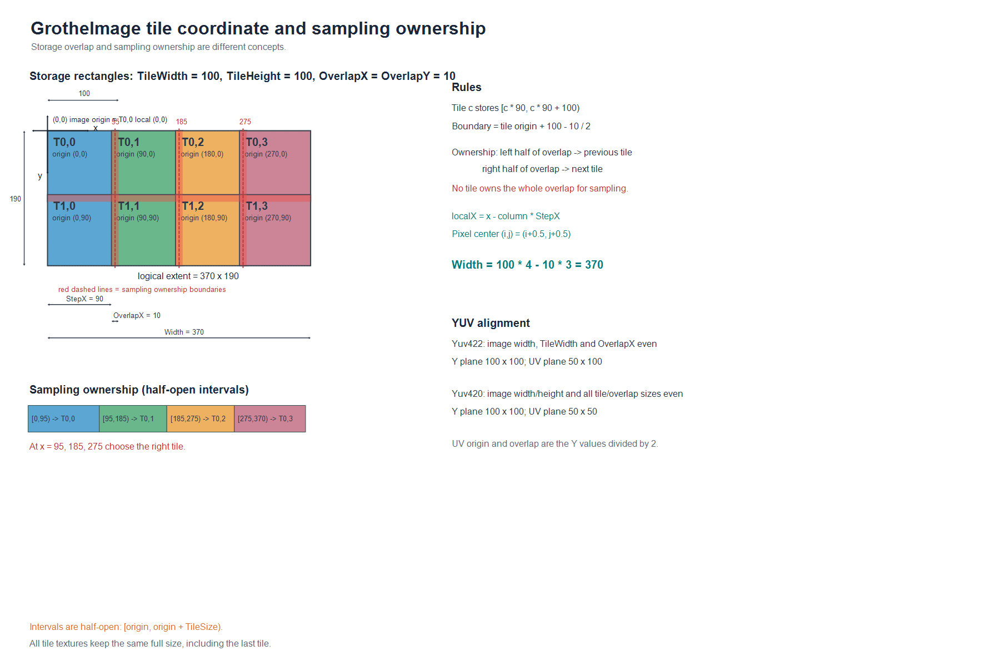

# GrotheImages 实现方案

## 1. 目标与边界

GrotheImages 是一个面向 .NET Framework 4.6.2 的 C# 图像处理库。它把逻辑上的超大图像拆成 GPU 纹理块，图像变换、重采样、图层组合和输出全部由 Direct3D 11 shader 完成。CPU 只负责 API 参数校验、内存拷贝、命令提交和资源生命周期管理。

第一版的目标是：

- 支持宽高远大于单张 Direct3D 纹理上限的图像，例如 100000 x 100000。
- 一个 `GrotheImage` 包含任意数量、带名称的 layer。
- 支持带透视变换的 `Update`、`Load` 和 `LayerCompose` 加载。
- 支持 BGRA/RGBA/Gray 的 GPU 传输；Yuv444/Yuv422/Yuv420 仅作为 GrotheImage 的原生双平面存储格式。
- 分块之间可有重叠，重采样时从重叠区域取样，避免块边缘出现透明或黑边。
- 所有变换和数学运算走 D3D11 计算/像素 shader；没有硬件时明确报错，不自动把核心处理降级到 CPU。

第一版不承诺跨设备共享纹理、远程 GPU 和任意格式的色彩管理。逻辑尺寸不受 D3D11 单纹理上限限制，但实际可存储像素数受后备存储容量限制；GPU 显存只作为 tile cache，不作为整幅图像的容量上限。

## 2. 项目创建与依赖

项目使用 SDK 样式 csproj，创建命令为：

```powershell
dotnet new classlib --name GrotheImages --framework net462
```

建议的项目设置：

```xml
<Project Sdk="Microsoft.NET.Sdk">
  <PropertyGroup>
    <TargetFramework>net462</TargetFramework>
    <LangVersion>latest</LangVersion>
    <AllowUnsafeBlocks>true</AllowUnsafeBlocks>
    <Nullable>enable</Nullable>
    <Platforms>x64</Platforms>
  </PropertyGroup>

  <ItemGroup>
    <PackageReference Include="Vortice.Direct3D11" Version="2.3.0" />
    <PackageReference Include="Vortice.DXGI" Version="2.3.0" />
    <PackageReference Include="Vortice.D3DCompiler" Version="2.3.0" />
    <PackageReference Include="System.Collections.Immutable" Version="*" />
  </ItemGroup>
</Project>
```

`record struct` 和 `nint` 使用现代 C# 编译器语法，但目标仍是 .NET Framework 4.6.2。若编译器提示缺少 `IsExternalInit`，在库内加入一个条件编译的内部空类型（不改变运行时 API）。

实现固定使用 Vortice 2.3.0；Vortice 3.x 已不再提供 .NET Standard 2.0 资产，不能直接用于 .NET Framework 4.6.2。`Vortice.*` 用于 Direct3D 11、DXGI 和 HLSL 编译，目标框架通过 `netstandard2.0` 兼容层连接到 .NET 4.6.2。选择 Vortice 而不是已停止维护的 SharpDX，是为了保留可维护的 D3D11/DXGI 包装层。

运行环境要求：Windows 10/11、x64、支持 D3D11 feature level 11_0 的硬件驱动。初始化时枚举 DXGI adapter，默认选用高性能硬件 adapter，并检查 `D3D11_FEATURE_D3D11_OPTIONS`、最大纹理尺寸、typed UAV 和 shader model 5 支持情况。

## 3. 分层架构

建议按下列内部项目组织代码，公开 API 和 Direct3D 类型隔离。

```text
GrotheImages/
  Public/
    GrotheImage.cs
    GrotheImageInfo.cs
    LayerCompose.cs
    PixelFormat.cs
    TransformMatrix.cs
  Core/
    GrotheImageCore.cs
    LayerStore.cs
    TileGrid.cs
    TileAddress.cs
    TileResource.cs
    TileArrayBinding.cs
  Graphics/
    D3D11DeviceContext.cs
    ShaderCompiler.cs
    UploadPipeline.cs
    DownloadPipeline.cs
    WarpPipeline.cs
    LoadRenderPass.cs
    ComposePipeline.cs
    FormatConversionPipeline.cs
  Expressions/
    Lexer.cs
    Parser.cs
    ExpressionAst.cs
    ExpressionTypeChecker.cs
    HlslEmitter.cs
  Diagnostics/
    GrotheImageException.cs
    GpuCapabilities.cs
```

`Public` 中的类型不暴露 Vortice 类型。`Core` 维护逻辑图像和 tile 索引，`Graphics` 只接收经过校验的内部命令，`Expressions` 负责从表达式到 HLSL 的编译。

## 4. 公共数据模型

### 4.1 变换矩阵

```csharp
public readonly record struct TransformMatrix(
    double M00, double M01, double M02,
    double M10, double M11, double M12,
    double M20, double M21, double M22)
{
    public static TransformMatrix Identity => new(
        1, 0, 0,
        0, 1, 0,
        0, 0, 1);
}
```

矩阵按列向量解释：

```text
[ x' ]   [ M00 M01 M02 ] [ x ]
[ y' ] = [ M10 M11 M12 ] [ y ]
[ w' ]   [ M20 M21 M22 ] [ 1 ]
```

最终坐标为 `(x'/w', y'/w')`，因此偏移位于第三列 `M02/M12`。`Update` 把输入图像坐标映射到 GrotheImage 的逻辑坐标；`Load` 把 GrotheImage 坐标映射到输出图像坐标。GPU kernel 在每个输出像素上使用矩阵逆变换寻找源坐标，这与 OpenCV `warpPerspective` 的采样语义一致。例：从 `(100,100)` 开始读取时，`Load` 传入平移 `(-100,-100)`。

矩阵求逆在 CPU 上预计算并传给 shader；奇异矩阵直接抛出 `ArgumentException`。矩阵元素先以 double 接收，提交到 GPU 前转换为 float，并检查转换后的有限值。

### 4.2 像素格式

```csharp
public enum PixelFormat
{
    Bgra32,
    Rgba32,
    Bgr24,
    Rgb24,
    Gray8,
    Yuv444,
    Yuv422,
    Yuv420,
}
```

`PixelFormat` 同时描述外部传输格式和 `GrotheImage` 的逻辑存储格式，但两种场景的合法值不同。`GrotheImage` 构造时可以选择任意一种格式；`Update`、两个 `Load` 重载和 `UpdateTile` 只接收/输出 `Bgra32`、`Rgba32`、`Gray8`。Bgr24、Rgb24 和所有 YUV 格式不作为用户图像传输格式；YUV 只表示 GrotheImage 的内部存储。

图像创建时的格式决定每个 layer tile 的物理资源：

| `GrotheImage` 格式 | tile 的 Direct3D 资源 | 逻辑通道 |
|---|---|---|
| `Bgra32` | 单张 `B8G8R8A8_UNORM` | R,G,B,A |
| `Rgba32` | 单张 `R8G8B8A8_UNORM` | R,G,B,A |
| `Bgr24` | 单张 `R8G8B8A8_UNORM`，A 固定为 1 | R,G,B |
| `Rgb24` | 单张 `R8G8B8A8_UNORM`，A 固定为 1 | R,G,B |
| `Gray8` | 单张 `R8_UNORM` | Gray，采样时复制为 R,G,B |
| `Yuv444` | Y 平面 `R8_UNORM` + UV 平面 `R8G8_UNORM`，尺寸均为 W x H | Y,U,V |
| `Yuv422` | Y 平面 `R8_UNORM` 为 W x H；UV 平面 `R8G8_UNORM` 为 (W/2) x H | Y,U,V |
| `Yuv420` | Y 平面 `R8_UNORM` 为 W x H；UV 平面 `R8G8_UNORM` 为 (W/2) x (H/2) | Y,U,V |

`Yuv422`/`Yuv420` 的 Y 和交错 UV 必须是两张独立纹理，不能拼成一张 packed texture；这样双线性采样可以分别按各自分辨率进行。`Yuv444` 也使用 Y/UV 双平面，避免把 YUV 语义误当成 RGB 纹理。

外部传输格式的内存布局只对允许的 `Update`/`Load` 格式定义：`Bgra32` 为 B,G,R,A，`Rgba32` 为 R,G,B,A，`Gray8` 为单通道。BGR/RGB 24 位和所有 YUV 格式不存在外部 `scan0` 传输布局。指针、stride、整数溢出和最小缓冲区大小都在提交 GPU 前检查。

内部通道使用归一化 float 语义，v1 不隐式执行 sRGB/gamma 转换。YUV 的 BT.709 limited 转换只发生在需要 RGB 输出或 RGB 输入写入 YUV layer 的 shader 中；表达式直接访问 YUV layer 时，`.r/.g/.b` 分别表示 Y/U/V，`.a` 为 1。

### 4.3 图像信息和 tile 网格

```csharp
public readonly struct GrotheImageInfo
{
    public GrotheImageInfo(
        long width,
        long height,
        int maxTileWidth,
        int maxTileHeight,
        int tileOverlapX = 0,
        int tileOverlapY = 0);

    public static GrotheImageInfo FromTiles(
        int tileWidth,
        int tileHeight,
        long tileRows,
        long tileColumns,
        int tileOverlapX = 0,
        int tileOverlapY = 0);

    public int TileWidth { get; }
    public int TileHeight { get; }
    public long TileRows { get; }
    public long TileColumns { get; }
    public int TileOverlapX { get; }
    public int TileOverlapY { get; }

    public long Width =>
        (long)TileWidth * TileColumns -
        (long)(TileColumns - 1) * TileOverlapX;

    public long Height =>
        (long)TileHeight * TileRows -
        (long)(TileRows - 1) * TileOverlapY;
}
```

提供两类布局创建方式：

1. 以逻辑 `width/height` 和最大 tile 尺寸构造，自动计算行列数和实际统一 tile 尺寸，并保证计算属性等于请求的逻辑尺寸。
2. 通过 `FromTiles(tileWidth, tileHeight, tileRows, tileColumns, overlapX, overlapY)` 直接使用给定的规则网格。
需要反序列化或复用完整布局时，使用 `FromTiles` 传入全部六个几何字段；不额外保存 width/height 副本。使用静态工厂可以避免“逻辑宽高”和“tile 行列”两个全数字构造函数发生重载歧义。

构造时强制满足：所有尺寸为正数；行列数为正数；`0 <= TileOverlapX < TileWidth`；`0 <= TileOverlapY < TileHeight`；计算结果不超过 `long`；tile 的实际纹理尺寸（含 overlap）不超过 adapter 的最大纹理尺寸。第一版只支持规则网格，因此所有 tile 使用相同 nominal 尺寸和 overlap。

逻辑坐标和 tile 坐标均使用 `long`，D3D11 资源内的局部坐标使用 `int`。所有 tile 的存储纹理尺寸完全相同，`TileWidth`/`TileHeight` 已经包含 overlap，不再为边缘 tile 创建更小的纹理。图像尺寸必须由规则网格公式产生，最后一个 tile 的完整尺寸正好落在逻辑图像边界上。

#### Tile 坐标定义

定义水平方向和垂直方向的步长：

```text
StepX = TileWidth  - TileOverlapX
StepY = TileHeight - TileOverlapY
```

第 `column` 列、第 `row` 行 tile 的逻辑原点（像素左上角坐标）为：

```text
TileOriginX = column * StepX
TileOriginY = row    * StepY
```

因此 tile `(row, column)` 覆盖的连续逻辑坐标范围是：

```text
[TileOriginX, TileOriginX + TileWidth)
[TileOriginY, TileOriginY + TileHeight)
```

相邻 tile 的交集就是 overlap。以 `TileWidth=100`、`TileOverlapX=10` 为例，`StepX=90`：第 0 个 tile 覆盖 `[0,100)`，第 1 个 tile 覆盖 `[90,190)`，交集为 `[90,100)`，两列的总宽度为 `100 + 90 = 190`。三列时为 `100 + 90 + 90 = 280`，与 `TileWidth * TileColumns - TileOverlapX * (TileColumns - 1)` 相同。

图像逻辑原点 `(0,0)` 位于第一个 tile 的局部原点 `(0,0)`，第一个 tile 没有负坐标的前置 overlap。对连续采样坐标 `(x,y)`，tile 的局部采样坐标为：

```text
localX = x - column * StepX
localY = y - row    * StepY
```

若使用像素中心约定，逻辑像素 `(i,j)` 的采样点为 `(i+0.5,j+0.5)`，再应用上式；因此第一个像素中心位于第一个 tile 的 `(0.5,0.5)`。

存储覆盖范围和采样归属范围必须分开定义。采样归属在 overlap 的中线处分界，令 `HalfOverlapX = TileOverlapX / 2.0`、`HalfOverlapY = TileOverlapY / 2.0`，则水平方向 tile 的采样归属区间为：

```text
first tile:  [0,                  TileWidth - HalfOverlapX)
middle tile: [TileOriginX + HalfOverlapX,
              TileOriginX + TileWidth - HalfOverlapX)
last tile:   [TileOriginX + HalfOverlapX, ImageWidth)
```

垂直方向使用完全相同的规则。以 `TileWidth=100`、`OverlapX=10`、四列为例，tile 原点分别是 `0、90、180、270`，存储覆盖分别是 `[0,100)`、`[90,190)`、`[180,280)`、`[270,370)`，但采样归属是 `[0,95)`、`[95,185)`、`[185,275)`、`[275,370)`。因此 overlap 的左半部分从上一个 tile 采样，右半部分从下一个 tile 采样；在边界 `x=95/185/275` 使用右侧 tile。不能把整个 overlap 区域固定交给一个 tile。

如果 overlap 为奇数，分界点可以是半像素；实现统一使用连续坐标比较，像素中心落在哪个半开区间就选择哪个 tile。为了让 YUV 子采样对齐，Yuv422/Yuv420 的 overlap 已经被要求为偶数，因此不会出现 UV 半像素归属边界。

YUV 格式还必须满足采样子采样的对齐约束。`Yuv422` 要求逻辑 `Width`、`TileWidth` 和 `TileOverlapX` 都为偶数；`Yuv420` 要求逻辑 `Width/Height`、`TileWidth/TileHeight` 以及两个 overlap 都为偶数。这样 tile 原点、步长和 UV 平面尺寸始终按 2 对齐：Yuv422 的 UV tile 为 `(TileWidth/2) x TileHeight`，Yuv420 的 UV tile 为 `(TileWidth/2) x (TileHeight/2)`。不满足这些条件时，`GrotheImage` 构造函数直接抛出 `ArgumentException`。自动计算 tile 的构造函数必须在候选尺寸中选择满足这些约束的偶数 tile；无法同时满足请求逻辑尺寸、最大 tile 尺寸和对齐条件时直接失败。

完整坐标示意图见 [coordinate_system_with_tiles.png](coordinate_system_with_tiles.png)：



### 4.4 GrotheImage 和 layer

```csharp
public sealed class GrotheImage : IDisposable
{
    public GrotheImage(
        GrotheImageInfo info,
        PixelFormat format,
        params string[] layerNames);

    public GrotheImageInfo Info { get; }
    public PixelFormat Format { get; }
    public ReadOnlyCollection<string> LayerNames { get; }

    public void Update(
        int layerIndex,
        nint scan0,
        int width,
        int height,
        int stride,
        PixelFormat format,
        TransformMatrix transformMatrix);

    public void Load(
        int layerIndex,
        nint scan0,
        int width,
        int height,
        int stride,
        PixelFormat format,
        TransformMatrix transformMatrix);

    public LayerCompose CreateLayerCompose(string expression);

    public void Load(
        LayerCompose layerCompose,
        nint scan0,
        int width,
        int height,
        int stride,
        PixelFormat format,
        TransformMatrix transformMatrix);

    public void UpdateTile(
        int layerIndex,
        long tileRow,
        long tileColumn,
        nint scan0,
        int width,
        int height,
        int stride,
        PixelFormat format);

}
```

为兼容较旧编译器，也可以在公共签名中使用 `IntPtr`，并用 `nint` 作为文档和调用方的等价写法；实现阶段应统一一种签名，不提供两套会产生歧义的重载。

三个图像处理入口 `Update`、`Load(int layerIndex, ...)` 和 `Load(LayerCompose, ...)` 都必须显式传入 `PixelFormat`，合法值只有 `Bgra32`、`Rgba32` 和 `Gray8`。`Load` 的 `format` 是输出格式。`UpdateTile` 没有 `TransformMatrix`，按 tile 行列坐标直接写入指定 tile；输入格式可以与 GrotheImage 的内部存储格式不同，由 GPU shader 完成转换。

由于 `GrotheImageInfo` 最终只保存几何字段，layer 名称和图像格式由 `GrotheImage` 传入，例如 `new GrotheImage(info, PixelFormat.Yuv420, "a", "b")`。构造函数复制并冻结 layer 名称：名称不能为空、不能重复、不能包含表达式语法中的 `.`, `,`, `(`, `)`, 运算符或空白。至少需要一个 layer。`LayerNames` 返回 `ReadOnlyCollection<string>`，因此调用方可以直接使用 `LayerNames.IndexOf(name)`；`layerIndex` 必须位于范围内。也可以增加 `GetLayerIndex(string name)` 辅助方法。

每个 layer 维护独立的 `LayerStore` 和 tile 资源，资源布局由 `GrotheImage.Format` 决定。新 layer 的 tile 初始为该格式的零值；带 alpha 的 RGB layer 初始 alpha 为 0，不带 alpha 的 RGB/Gray layer 初始通道为 0，YUV layer 初始为 Y=0、U=V=0.5。逻辑图像边界之外统一返回透明，逻辑范围内尚未写入的像素保留格式零值。`Update` 写入后，重叠区域由写入 shader 同时覆盖到所有相交 tile；建议增加内部 per-tile generation，保证读写命令提交顺序可追踪。

## 5. GPU 资源和分块策略

### 5.1 资源布局

- 每个 layer 的 tile 按统一尺寸装入 `Texture2DArray`，array slice 是 tile 的线性索引 `row * TileColumns + column`。物理格式由 `GrotheImage.Format` 决定；Yuv422/Yuv420 绑定两组同步的 array，分别保存 Y 和 UV 平面。
- tile 纹理的宽高就是统一的 `TileWidth`/`TileHeight`（其中已包含 overlap），并保留 `validRect`、逻辑原点和各平面尺寸。Yuv422/Yuv420 的 UV 平面尺寸及 UV 原点按 2 倍子采样换算，不直接复用 Y 平面的像素宽度。
- 输入使用临时 upload texture；输出使用临时 readback staging texture。输入/输出格式转换、YUV 平面编码/解码和 warp 分开成明确的 shader pass，便于复用和测试。
- 图像对象只保存 tile 元数据和 GPU 资源句柄，不创建 `Width * Height` 的连续 CPU 数组。

例如 100000 x 100000、tile 2048、overlap 16 的图像约有 2500 个 tile。资源按需创建：第一次写入或读取某 tile 时才申请显存。GPU 显存不足时不能简单失败，因为逻辑图像可能远大于显存；因此 `TileCache` 必须有 LRU 回收和后备存储。

### 5.1.1 后备存储和 GPU cache

每个 `GrotheImage` 创建一个内部 `ITileBackingStore`，默认实现是临时文件支持的稀疏 tile 存储；文件中只为实际写入过的 tile 分配记录。每条记录包含 tile generation、有效矩形、格式标识和各物理平面的数据。GPU 中的 `TileResource` 是可丢弃 cache，`TileArrayBinding` 负责把本次 Load/Compose 所需的 tile 按固定 slice 顺序组成 shader 参数：

1. 读写前把需要的 tile 锁定并确保它已上传 GPU；首次使用的 tile 以透明值初始化。
2. shader 完成后标记 tile dirty。cache 压力达到阈值时，先把 dirty tile readback 到后备存储，再释放 GPU 资源。
3. 后续访问从后备存储重新上传并放入 `Texture2DArray` slice；上传/下载只是存储迁移，像素变换仍然在 GPU 上完成。
4. `Dispose` 等待 GPU fence，关闭并删除临时文件。实现可以增加显式路径或持久化后端，但不改变 `GrotheImageInfo` 的六个几何字段。

因此 100000 x 100000 图像的逻辑大小不受单张纹理和显存限制，实际限制是磁盘/内存后备存储能否容纳已写入 tile。后备存储 I/O 和 GPU 资源迁移属于容量管理，不把处理过程降级为 CPU 算法。

### 5.1.2 Texture2DArray 分页

`Load`/compose 的渲染 pass 不对每个 tile 单独 dispatch。调度器先根据输出矩形和逆变换计算可能被访问的 tile 集合，把这个集合的所有 tile 资源装入 `Texture2DArray`，并把 array、tile 原点、步长、列数和图像边界作为 shader 参数一次绑定。像素着色器对每个输出像素自行完成 tile 选择和局部坐标计算。

D3D11 对单个 `Texture2DArray` 的 slice 数量和单次绑定的 SRV 数量都有设备上限，因此 `TileArrayBinding` 支持 page：每个 page 包含连续的 tile slice，并记录全局 tile index 到 `(page, slice)` 的映射。一次 Load 优先绑定覆盖输出区域的所有 page；如果 page 数超过 SRV 上限，才按 page 集合分成多个 render pass，每个 pass 仍由像素着色器按坐标采样，不回退到 CPU 逐像素处理。超出 GPU 工作集的 tile 在 pass 前从后备存储上传，pass 后按 cache 策略回收。

### 5.2 tile 交集和 overlap

每个 GPU 操作先在 CPU 上计算变换后输出矩形与 tile 网格的交集，建立参与本次 render pass 的 tile array/page 集合；每个 page 集合只生成一个全输出 render dispatch，而不是每个 tile 一个 dispatch。采样调度使用“采样归属区间”而不是整个存储矩形：重叠区中线左侧归上一个 tile，中线右侧归下一个 tile，边界使用右侧 tile。tile 内部的双线性 footprint 仍可读取本 tile 的 overlap 数据；超出整个图像范围时返回透明 `(0,0,0,0)`。不要把越界采样配置为 sampler border black 后再拼接，因为 tile 内部边缘必须优先采样 overlap。

若输入写入只覆盖一个 tile 的内部，但它影响相邻 tile 的 overlap，则写入计划会扩展到所有相交 tile。重叠区域的最终值遵循提交顺序；若应用需要无缝拼接，应从同一源图像/同一变换批量提交，避免两个来源对重叠区域产生未定义覆盖。

## 6. 变换、Update 和 Load 管线

### 6.1 Update

`Update` 的矩阵把输入图像坐标映射到 GrotheImage 逻辑坐标。实现步骤：

1. 校验参数、源缓冲区大小、格式、矩阵和目标 layer。若 `format` 是 `Yuv422` 或 `Yuv420`，立即抛出异常；这两个值只表示 GrotheImage 的内部存储格式。
2. 根据矩阵变换输入矩形的四个角，得到可能覆盖的逻辑包围盒，并与图像边界相交。
3. 把允许的源格式上传到 upload texture；必要时在 GPU 中转换为图像格式的逻辑通道。若目标 layer 是 Yuv422/Yuv420，使用 YUV encode pass 分别写 Y 和 UV UAV；UV 写入按照目标格式的半分辨率坐标进行滤波。
4. 对每个相交 tile dispatch `UpdateWarpCS`。shader 以 tile 输出像素为坐标，使用逆矩阵取得输入坐标，进行双线性采样，并写入该 tile 的单纹理或多平面 UAV。
5. 插入 UAV barrier/资源状态转换，更新 tile generation，释放临时资源。

源图像之外的采样值为透明。对于透视变换，齐次坐标 `w` 接近 0 或无效时跳过写入。输入矩阵使用像素中心约定：像素中心为 `(x + 0.5, y + 0.5)`，避免旋转和缩放时产生半像素偏移。

### 6.2 UpdateTile

`UpdateTile` 不接受 `TransformMatrix`，也不根据逻辑图像矩形规划 tile；调用方直接指定 `tileRow/tileColumn` 和该 tile 的存储尺寸。它适合从外部 tile cache、解码器或持久化后端恢复原生 tile 数据。

- 单指针重载用于 `Bgra32`、`Rgba32`、`Gray8`，输入与目标存储格式不同的转换由 GPU 完成，不执行几何变换。宽高必须匹配统一的 `TileWidth`/`TileHeight` 存储尺寸（包括 overlap）；边缘 tile 也使用相同尺寸，逻辑边界由网格公式确定。

该 API 仍通过 GPU upload/copy 写入 tile 资源；“直接”指直接定位 tile、不做透视和全图坐标变换，不代表允许 CPU 逐像素写入 GPU 纹理。

### 6.3 Load

`Load(layerIndex, ...)` 的矩阵把 GrotheImage 逻辑坐标映射到输出坐标。实现步骤：

1. 校验输出 `format`。若为 `Yuv422` 或 `Yuv420`，立即抛出异常；它们不能作为外部 packed 输出。
2. 创建匹配输出尺寸和输出格式的 GPU render target；`scan0` 只作为最后的 readback 目标，不直接作为像素着色器 render target。
3. 按输出矩形和逆矩阵计算可能被访问的源逻辑区域，加载该区域需要的全部 tile，建立 `TileArrayBinding`，并把所有参与本次 pass 的 tile array/page、tile 网格参数和矩阵常量绑定到像素着色器。
4. 对输出的每个像素执行 `LoadTilePS`。像素着色器先用逆矩阵把输出像素中心反算到源坐标，再按采样归属中线计算 tile 行列、array page/slice 和 tile 局部坐标，最后调用线性 sampler 从对应 `Texture2DArray` slice 采样。它不按 tile 分别 dispatch。
5. 对 Yuv422/Yuv420 源 tile，像素着色器同时从 Y array 和 UV array 采样，然后按请求的 BGRA、RGBA 或 Gray 输出格式编码。`LayerCompose` 版本在同一个像素着色器中对采样出的逻辑通道执行编译后的 AST。
6. GPU 完成 render target 和格式转换后复制到 staging texture，再把 staging 数据复制到调用方的 `scan0`。API 默认同步返回，内部可预留 command fence 以便以后增加异步版本。

像素着色器的核心坐标计算等价于：

```hlsl
float3 q = mul(InverseTransform, float3(outputPixelCenter, 1));
float2 source = q.xy / q.z;
if (!InsideImage(source)) return Transparent;

float2 step = float2(TileWidth - OverlapX, TileHeight - OverlapY);
int column = clamp((int)floor((source.x - 0.5 * OverlapX) / step.x), 0, TileColumns - 1);
int row    = clamp((int)floor((source.y - 0.5 * OverlapY) / step.y), 0, TileRows - 1);
float2 local = source - float2(column, row) * step;
int slice = row * TileColumns + column;
float2 uv = local / float2(TileWidth, TileHeight);
float4 value = TileArray.SampleLevel(LinearSampler, float3(uv, slice), 0);
```

实际实现会把 `slice` 拆成 page 和 page-local slice，并对 YUV UV array 使用对应的二分之一坐标。`floor(source - overlap/2)` 体现采样归属规则：例如边界 `95` 之后选择第二个 tile，而不是把整个 `[90,100)` overlap 交给第一个 tile。

## 7. LayerCompose 与表达式编译

### 7.1 API 和对象语义

```csharp
public sealed class LayerCompose
{
    public string Expression { get; }
    public int OutputChannelCount { get; }
}
```

`CreateLayerCompose` 在创建时完成词法分析、语法分析、layer 名称绑定、通道检查和 HLSL 编译。返回对象是不可变的，可被多个 `Load` 调用复用。表达式非法时立即抛出包含字符位置的 `FormatException` 或 `ArgumentException`，而不是等到 GPU 执行时失败。

所有 layer 属于同一个 `GrotheImage`，因此共享同一个存储格式。表达式读取的是图像格式的逻辑通道：RGB 是 R/G/B/A，Gray8 直接使用采样器返回的通道结果，YUV 是 Y/U/V/A。编译器为每种存储格式生成对应的采样 accessor；YUV accessor 同时绑定 Y 和 UV SRV。输出 `format` 只能是 `Bgra32`、`Rgba32` 或 `Gray8`，其他格式直接异常。

### 7.2 第一版语法

```text
compose       := expression (',' expression)*
expression    := additive
additive      := multiplicative (('+' | '-') multiplicative)*
multiplicative:= unary (('*' | '/') unary)*
unary         := ('+' | '-') unary | primary
primary       := number | '(' expression ')' | reference
reference     := identifier accessor+
accessor      := '.' swizzle | '.' member arguments?
member        := identifier
arguments     := '(' expression (',' expression)* ')'
swizzle       := 'r' | 'g' | 'b' | 'a' | 'rg' | 'gb' | 'rgb' | 'rgba'
```

语义规则：

- `a.r` 是标量，`b.gb` 是二维向量，`a.rgb` 是三维向量。
- 标量与向量运算按标量广播；相同维度向量逐分量运算。
- 两个不同维度的向量不隐式扩展，避免 `rgb + gb` 产生不明确结果。
- 乘法和除法是逐分量运算，不支持矩阵乘法或 dot product。
- 逗号分隔的结果会把每个标量/向量结果按顺序展开，因此 `a.r, b.gb` 是 3 个输出通道。表达式通道数不足 4 时按固定规则补成完整像素：3 通道 → `(x, y, z, 1)`，2 通道 → `(x, y, 0, 1)`，1 通道 → `(x, x, x, 1)`。也就是说缺失的颜色通道补 0，缺失的 alpha 补 1（=255），单通道结果当作灰阶复制到 R/G/B。Gray8 输出只存一个通道，取补齐后像素的 red，所以 1–4 通道的表达式都能输出为 Gray8；BGRA/RGBA 接受 1–4 个通道。YUV 和 24 位格式不能作为 compose 输出；RGB 与 YUV 存储域之间的转换由输出 shader 负责。
- 常量为 float；表达式结果在 `[0,1]` 外不截断，输出 shader 的最后一步才 clamp。
- swizzle 只能取操作数已有的通道，`a.rgb.a` 在编译期报错，而不是等到 HLSL 编译。
- `layer.member` 是 `Shaders/Common.hlsl` 里的函数调用，见 7.2.1。
- 通道只有位置语义，没有名字语义：`a.a, a.r, a.g, a.b` 就是把 a 通道放到 red、r 放到 green、g 放到 blue、b 放到 alpha（Bgra32 输出时内存顺序才是 B,G,R,A）。编译器不会做任何按名字推断的转换。

示例：

```text
a.r, b.g, b.b
a.r - 0.2 * 3, (b.g - 0.5) * 2, (b.b - 0.5) * 2
a.gb - b.gb
a.lum, b.rgb
```

`a.gb - b.gb` 产生二维结果，补齐规则会把它当作 `(r, g, 0, 1)` 输出；如果蓝色不该是 0，就继续拆成两个逗号项，或与另一个标量通道组合。

### 7.2.1 成员：`layer.member`

`Shaders/Common.hlsl` 中声明的每个函数都是 layer 的“成员”。`layer.member` 把该 layer 解码出的 `float4` 作为函数的第一个参数，`layer.member(args...)` 的其它参数按顺序跟在后面：

```text
a.lum                 -> lum(Layer0)                              1 通道
a.rgb.lum             -> lum(Layer0.rgb)                          1 通道
a.hsv.rgb             -> (hsv(Layer0)).rgb                        3 通道
a.bin(0.5)            -> bin(Layer0, (float4)(0.5))               4 通道
a.bin2(0.1, 0.4)      -> bin2(Layer0, (float4)(0.1), (float4)(0.4))
a.bin(b.r)            -> bin(Layer0, (float4)(Layer1.r))
```

- 成员表在运行时从 `Common.hlsl` 的函数签名解析得到，因此新增或修改成员只需要改 shader 文件，C# 侧没有第二份需要同步的名单。签名参数无法用 float1..float4 表达（例如 `int`）时，该重载对表达式不可见。
- 重载按第一个参数（操作数）的宽度和参数个数选择。其余参数必须宽度完全匹配，或者是标量（生成 HLSL 时显式 splat 成 `floatN`，不依赖隐式标量提升）。
- 成员结果的宽度决定它在表达式里贡献的通道数，例如 `a.lum` 是 1，`a.bin(0.5)` 是 4。返回值之后还可以继续 swizzle 或再套成员。
- 找不到匹配重载、参数个数不符或引用了不存在的成员时，`CreateLayerCompose` 立即抛出带字符位置和可用重载列表的 `FormatException`。
- 只有真正用到成员的表达式才会把 `Common.hlsl` 拼进生成的 shader；纯 swizzle 表达式保持原有的源码。
- 所有 layer 共享同一个 `Common.hlsl`，成员输入是逻辑通道（RGB 为 R/G/B/A，Gray8 为 v/v/v/1，YUV 为 Y/U/V/1），因此 `a.lum` 在 YUV 图像上按 (Y,U,V) 计算。

### 7.3 HLSL 生成和缓存

AST 经类型检查后生成 HLSL 函数。每个 layer 引用编译成对该 layer `Texture2DArray`/YUV 双 array 的采样 accessor，矩阵逆变换、采样归属 tile 计算和 page/slice 选择由 Load render pass 统一完成。普通 Load program 存在 GrotheImage 中，Compose Load program 存在 LayerCompose 中；同一实例重复 Load 时复用已经创建的 shader、sampler 和 constant buffer。`UpdateProgram` 也按 GrotheImage 保存一个实例，第一次 Execute 时延迟创建目标存储格式对应的 shader，之后在 Bgra32、Rgba32、Gray8 输入之间复用。

生产模式下优先使用离线 shader 编译产物，开发模式允许调用 `D3DCompile` 并记录源码。编译错误转换为 `GrotheImageException`，其中包含原表达式、生成的 HLSL 和编译器行号，方便定位。

当一次 compose 读取多个 tile 时，各 layer 必须使用同一逻辑坐标和同一边界透明规则。调度器按 tile 组合规划 dispatch，不能让不同 layer 采用不同的 tile 原点，否则表达式中的通道会错位。

## 8. Direct3D 设备和线程模型

内部 `D3D11DeviceContext` 负责：

- DXGI adapter 枚举和 feature level 检查。
- 一个 D3D11 device、immediate context、命令锁和 fence/flush 策略。
- shader、sampler、buffer 和临时纹理池的生命周期。
- `ID3D11DeviceContext` 的串行提交。

`GrotheImage` 的公开方法默认线程安全：多个线程可以调用，但命令会在设备提交锁中串行化；同一个 image 的写读顺序以方法返回顺序为准。不同 `GrotheImage` 可以共享进程级 device，但 tile 元数据和生命周期独立。`Dispose` 后所有 API 抛出 `ObjectDisposedException`，并等待已提交 GPU 工作完成后释放资源。

第一版采用同步 API，以保证调用方在返回时可以安全复用输入/输出内存。后续可以增加 `UpdateAsync`/`LoadAsync` 和显式 fence，但不能让当前同步方法隐式返回尚未完成的 DMA。

## 9. 错误、边界和诊断

统一定义 `GrotheImageException`，至少包含 operation、layer、tile 坐标、HRESULT 和 adapter 信息。以下情况在 CPU 端尽早失败：

- null/无效指针、stride 太小、宽高非正数或缓冲区大小溢出。
- layer index 越界、layer 名称重复或表达式引用未知 layer。
- 变换矩阵含 NaN/Infinity、不可逆或透视除数可能无效。
- `Update`/`Load` 使用 YUV 或 24 位格式。
- Yuv422/Yuv420 的逻辑尺寸、tile 尺寸、overlap、Y/UV 平面尺寸、平面 stride 或 UV 交错约束不满足；这些格式按 2 倍子采样要求相关宽高和坐标偶数对齐。
- tile overlap 不小于 tile 尺寸、逻辑尺寸超出 `long` 或单 tile 超出设备限制。
- adapter 不支持所需 D3D11 feature、shader model 或 typed UAV。

提供可选 `GrotheDiagnostics`（或内部日志接口）记录每次操作的 tile 数、dispatch 数、上传字节数、shader cache 命中率、GPU 时间和资源峰值。日志默认关闭，避免把每个像素操作写入应用日志。

## 10. 测试和验证计划

测试分为不需要 GPU 的契约测试和需要真实 D3D11 硬件的集成测试。

契约测试覆盖：

- `GrotheImageInfo` 的宽高公式、overlap 和溢出检查。
- 矩阵乘法、逆矩阵、像素中心和负偏移语义。
- layer 名称冻结、索引查找和 dispose 行为。
- 表达式 lexer/parser/type checker，包括标量广播、维度错误和未知 layer。
- stride、Yuv422/Yuv420 tile 双平面尺寸和各种像素格式的缓冲区校验。

GPU 集成测试覆盖：

- 1 x 1、非整 tile、单 tile、多 tile 和 100000 x 100000 的稀疏写入/读取。
- identity、平移、旋转、缩放和透视变换，与 CPU 参考实现比较误差。
- overlap=0 与 overlap>0 的边界采样，确认没有黑边/透明边。
- 双 layer compose、通道重排、向量广播和 clamp 行为。
- BGR/RGB/BGRA/RGBA/Gray/Yuv444 往返转换；Yuv422/Yuv420 的 Y/UV 原生 tile 更新与采样；向 `Update`/`Load` 传入 Yuv422/Yuv420 时抛出异常。
- 多线程提交顺序、GPU 资源释放和显存不足诊断。

测试图像使用确定性合成图（坐标渐变、棋盘格、单通道常量），并对每个输出像素设置绝对/相对误差阈值。CI 至少需要一台真实 D3D11 adapter；没有 GPU 的构建机只运行契约测试，不能把 WARP 结果当作硬件加速验证。

## 11. 分阶段实施

1. 创建 SDK 项目、设备封装、`GrotheImageInfo`、矩阵和像素格式契约。
2. 实现单 layer、无透视的 tile 资源、GPU cache 和临时文件后备存储，再接入上传和下载。
3. 加入 `Update`/`Load` 的仿射与透视 shader、overlap 规划和边界规则。
4. 加入 layer compose parser、类型检查、HLSL emitter 和 shader cache。
5. 加入 YUV 转换、输出格式转换、诊断、资源池和压力测试。
6. 在 API 稳定后再评估异步命令、可替换持久化后端、texture atlas 和更多色彩空间。

每一阶段都保留 CPU 参考实现用于测试对照，但参考实现不作为生产路径或无 GPU fallback。第一阶段结束前先锁定 YUV 的内存布局和 layer 内部数值语义，这两个契约一旦公开后再修改会破坏已有调用方。

## 12. 需要在实现前确认的决策

- 第一版是否接受只支持 D3D11、Windows x64，以及无硬件时直接失败。
- YUV 是否只作为 GrotheImage 创建时的内部存储格式；当前 Update、Load 和 UpdateTile 均不接受 YUV 用户缓冲区，UpdateTile 也不再提供 Y/UV 双指针重载。
- 后续是否增加可配置的线性/sRGB/gamma 转换；v1 固定使用归一化数值空间。
- `Load` 的输出 alpha 是否允许表达式指定，还是所有无 alpha 输出固定为 1。
- 同一重叠区域被多次 `Update` 写入时是否采用最后提交者覆盖，或需要额外的 blend 策略。
- 是否允许调用方指定后备文件路径并在多个 `GrotheImage` 之间复用持久化 tile 文件；默认临时文件后端不依赖这一扩展。

## 13. 二进制序列化

实现提供 `GrotheImage.Serialize(Stream)`、`GrotheImage.Deserialize(Stream)`、`Save(string)` 和 `Open(string)`。文件头依次包含 ASCII magic `GROTHEIM`、32 位 version code、六个 `GrotheImageInfo` 几何字段、`PixelFormat`、layer 名称列表和已写入 tile 数量。

反序列化先读取 magic/version，再通过内部 `IGrotheImageLoader` 注册表选择加载器。目前注册 `GrotheImageLoaderV1`，未知版本直接抛出 `NotSupportedException`。每条 tile 记录保存 layer、row、column、plane 数量、plane 宽高、字节数和逐行原生纹理数据；Yuv444/Yuv422/Yuv420 保存独立 Y/UV plane。所有长度、坐标、格式、plane 数量和文件结束位置都校验，重复 tile 坐标和截断 payload 直接判定为损坏文件。

序列化使用稀疏策略，只写入实际经过 `Update` 或 `UpdateTile` 的 tile；未写入 tile 由构造时的格式零值恢复。新增文件版本时只需实现新的 `IGrotheImageLoader` 并注册对应 version code，不修改已有加载器。

## 14. GrotheImagesPlayground

`GrotheImagesPlayground` 是 SDK 样式 WPF `net462` 应用，使用默认 WPF 控件样式。界面按 Tab 分为：

- New：逻辑尺寸布局和 `FromTiles` 等尺寸、overlap、格式、layer 参数。
- Update：图片文件、layer、源宽高、stride、传输格式和四点拖拽透视区域。
- UpdateTile：tile 行列、尺寸、stride、普通文件或 Y/UV 原生 plane 文件。
- Load / Export：layer 或 compose、输出尺寸、stride、格式、四点目标区域和导出文件。
- Persistence：保存/打开 versioned GrotheImage 二进制文件。

四点编辑器以 source rectangle 的四个角为输入，通过八元一次方程求解 3x3 透视矩阵；Update 的 source rectangle 是输入文件尺寸，Load 的 source rectangle 是 GrotheImage 逻辑尺寸，目标点坐标分别落在 GrotheImage 或导出图像坐标系中。
